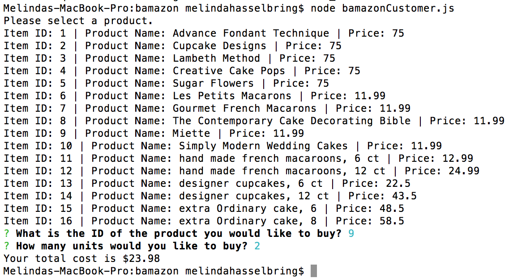
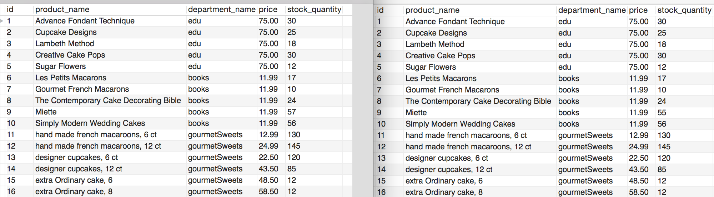
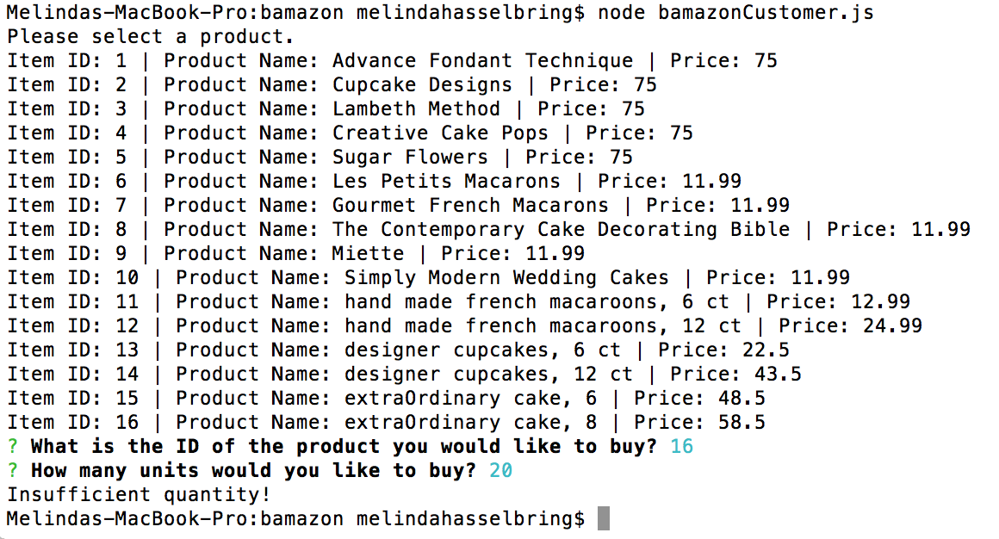
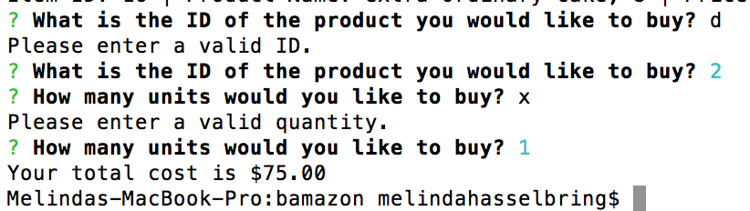

# Bamazon
Unit 12 Assignment: Node.js & MySQL

## Overview for Bamazon Customer.

*Bamazon project* is an Amazon-like storefront aplication. 

1. When a Node application called `bamazonCustomer.js` is run, it will first display all of the items available for sale. The display includes ids, names, and prices of products.  

1. It will then continue to display a question that would ask the user "What is the ID of the product you would like to buy?"  After the user enters the item_id and clicked 'enter', it will then continue to ask the user "How many units would you like to buy?" 

1. Once the order was placed, the app will check if there is enough inventory to fulfill the request.
    
    i.) If there is enought inventory, the app will display the total cost, 
    and deduct the number of unit/s from inventory to reflect the current inventory on hand.

* Below is the inventory record before and after the order for item 9.

    ii.) If not, the app will log a phrase  `Insufficient quantity!`, and then prevent the order from going through.     

* Bamazon app also validates the data entered.  If the data is not correct, it will throw a notification error and will ask the user to enter the corect data.

**Follow these to get started.**

## Installation Instructions:

### Must create a database by running the bamazon.sql

### Run the following command to initialize npm and install all dependencies
    npm init
    npm install

### Install production dependencies using this command
    npm install mysql --save
    npm install inquirer --save
    npm install console.table --save

###Use the right password.
    modify bamazonCustomer.js to reflect your own connection password.

### Execute the following command to run the project:
    node bamazonCustomer.js

